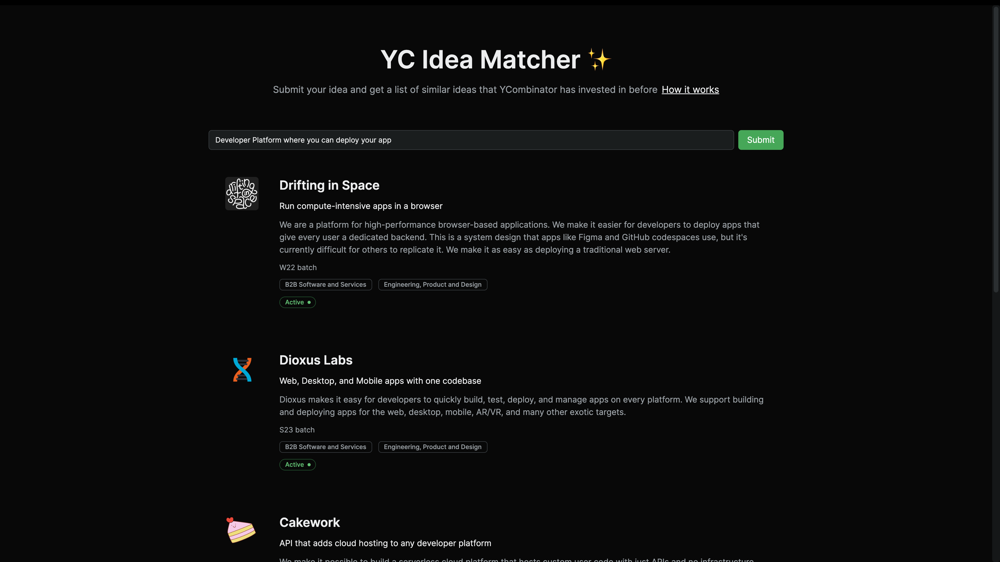

# YC idea matcher

This project allows you Submit your idea and get a list of similar ideas that YCombinator has invested in before.

The project is built using the following technologies:

- [Neon](https://neon.tech): Serverless Postgres
- [pg_embedding](https://github.com/neondatabase/pg_embedding): open-source Postgres extension for vector storage and similarity search
- [Neon Serverless Driver](https://github.com/neondatabase/serverless)
- [Next.js](https://nextjs.org): Fullstack framework for React
- [Vercel](https://vercel.com): deployment platform
- [OpenAI API](https://openai.com): generating vector embeddings
- [TailwindCSS](https://tailwindcss.com): Utility-first CSS framework
- [Upstash Redis](https://upstash.com): serverless Redis for rate limiting
- [Zod](https://zod.dev): TypeScript-first schema validation
- [React Query](https://react-query.tanstack.com): data fetching and caching library
- [Vaul](https://vaul.emilkowal.ski/): Drawer component for React.

## How the app works

You will find a script called `generate-embeddings.ts` located in the root directory of this project. After running `npm run generate-embeddings`, the script does the following:

1. It creates the database schema and installs the `pg_embedding` extension
2. It goes through the YCombinator API 'https://api.ycombinator.com/v0.1/companies?page=1' and gets all the companies
3. For each company it generates embeddings using the long description and then stores the company data in the database.
  
> Some companies don't have a long description, so we needed to manually remove those from the database by running `delete from companies WHERE embedding = ARRAY[]::real[];`

The app itself is a Next.js app with an API route located at `/api/idea`. Whenever a user submits an idea, the following happens:

1. The idea is sent to the OpenAI API to generate an embedding
2. We then use pg_embedding to retrieve the top 3 most similar ideas
